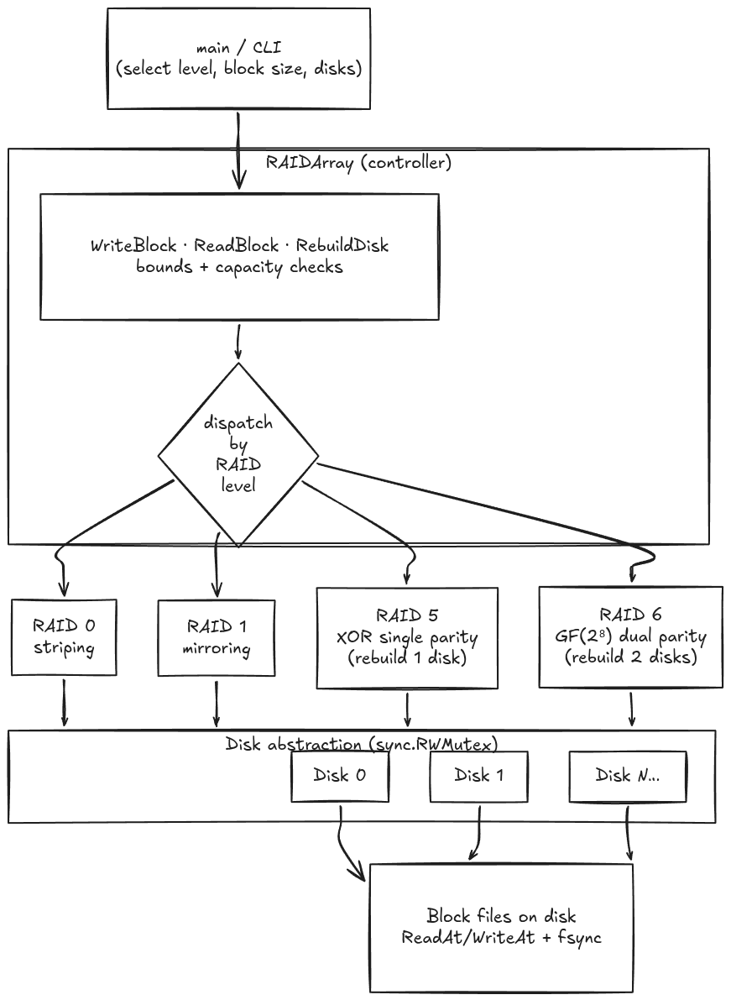

# go-software-raid

Software RAID 0, 1, 5 and 6 implemented in Go. Disks are backed by flat files, blocks are read/written through the RAID abstraction layer.

## Architecture

### Summary

- A **user-space RAID simulator** in Go, single process and CLI-driven. Physical disks are emulated by fixed-size **block files**: each `Disk` does offset-based `ReadAt`/`WriteAt` with `fsync` per write, per-disk R/W counters, and a `SetFailed` switch to simulate hardware failure.
- A central **`RAIDArray` controller** validates configuration (min disk counts, block size), computes usable capacity per level, and **dispatches** logical block `Read`/`Write`/`Rebuild` to one of four level implementations.
- **Levels**: RAID 0 (striping, no redundancy), RAID 1 (mirroring), RAID 5 (striping + single XOR parity, rebuild from 1 failed disk), RAID 6 (striping + dual parity via **GF(2⁸)** arithmetic, rebuild from 2 failed disks).
- No services, network, or external dependencies — it is a layered storage abstraction (controller -> level strategy -> disk/file) exercised by a unit-test suite covering degraded reads, rebuild, parity correctness, and concurrent access.



## RAID levels

- **RAID 0** — striping across 3 disks, no redundancy
- **RAID 1** — mirroring across 2 disks, full redundancy
- **RAID 5** — striping + distributed parity across 4 disks, survives one disk failure
- **RAID 6** — striping + dual distributed parity (P + Q) across multiple disks, survives up to two disk failures

## Run

```
go run . -level 0
go run . -level 1
go run . -level 5
go run . -level 6
```

Flags:
- `-level` — RAID level (default: 5)
- `-block-size` — block size in bytes (default: 4096)
- `-blocks` — blocks per disk (default: 100)

Disk images are created under `disks/raid<level>/`.

## Test

```
go test ./...
```
